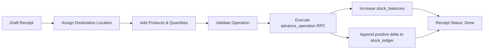
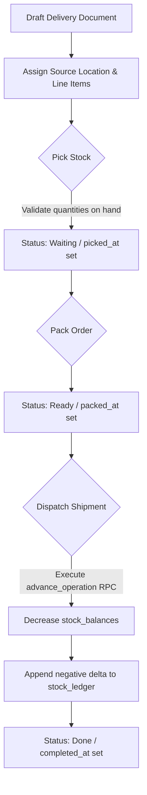
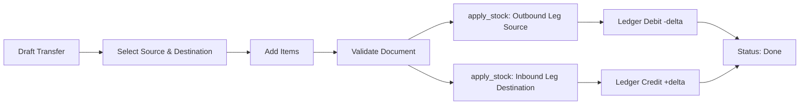
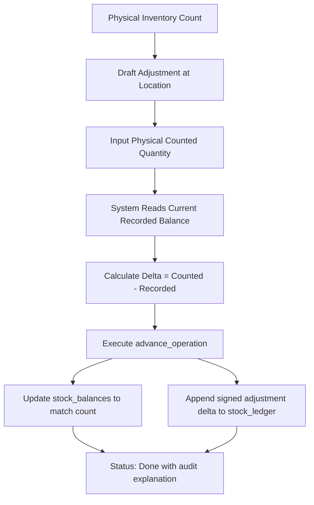
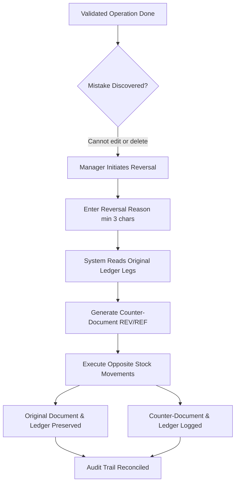

# StockSense

Real-time inventory operations for modern warehouse teams.


StockSense is a full-featured inventory operations platform built for warehouse staff, operations managers, and inventory controllers. It delivers multi-warehouse inventory visibility, validated multi-step movements, demand-driven replenishment analytics, role-governed workflows, and an append-only stock ledger that provides a permanent audit trail for every unit moved.

---

## Table of Contents

- [Product Overview](#product-overview)
- [The Problem](#the-problem)
- [How StockSense Solves It](#how-stocksense-solves-it)
- [Core Features](#core-features)
  - [Inventory & Catalogue Management](#inventory--catalogue-management)
  - [Operational Movements (Receipts, Deliveries, Transfers, Adjustments)](#operational-movements)
  - [Append-Only Stock Ledger & Document Reversals](#append-only-stock-ledger--document-reversals)
  - [Replenishment Analytics & Demand Math](#replenishment-analytics--demand-math)
  - [Deterministic Warehouse Stock Analysis](#deterministic-warehouse-stock-analysis)
  - [Team Administration & Role-Based Access](#team-administration--role-based-access)
  - [Authentication & Account Recovery](#authentication--account-recovery)
- [Operation Workflows](#operation-workflows)
- [System Architecture](#system-architecture)
- [Security Architecture](#security-architecture)
- [Roles & Permissions Matrix](#roles--permissions-matrix)
- [Technology Stack](#technology-stack)
- [Project Structure](#project-structure)
- [Local Development](#local-development)
- [Database Setup & Migrations](#database-setup--migrations)
- [Environment Variables](#environment-variables)
- [Demo Accounts & Seed Data](#demo-accounts--seed-data)
- [Testing & Quality Assurance](#testing--quality-assurance)
- [Production Deployment on Vercel](#production-deployment-on-vercel)
- [Production Readiness Checklist](#production-readiness-checklist)
- [Roadmap](#roadmap)
- [License](#license)

---

## Product Overview

Managing physical stock across multiple storage facilities demands absolute precision. When balances are updated via ad-hoc database edits or unvalidated forms, stock numbers drift, shipments fail, and auditability collapses.

StockSense approaches inventory as an accounting ledger:

- **No Direct Balance Overwrites**: Balances are calculated and updated strictly through database-level transactional Remote Procedure Calls (RPCs).
- **Append-Only Movement Ledger**: Every movement creates an immutable record capturing who executed it, the exact timestamp, source and destination locations, quantity delta, resulting balance, and operational reason.
- **Auditable Corrections**: Historical documents and ledger entries are never deleted or rewritten. Mistakes are corrected by posting validated counter-documents.
- **Database-Enforced Authorization**: Row-Level Security (RLS) policies in PostgreSQL protect workspace data across all operations, independent of the frontend user interface.
- **Algorithmic Replenishment**: Predicts stockout risks and suggests reorder quantities using 8-week historical demand patterns and variance scoring without reliance on third-party language models.

---

## The Problem

Traditional inventory processes in small-to-medium facilities face systemic operational pitfalls:

| Operational Challenge                     | Real-World Impact                                                                                                       |
| ----------------------------------------- | ----------------------------------------------------------------------------------------------------------------------- |
| **Manual spreadsheets & paper registers** | Disconnected data silos, double-entries, and untracked discrepancies between physical and recorded counts.              |
| **Unvalidated balance edits**             | Direct balance updates erase historical context, making it impossible to diagnose when or why stock went missing.       |
| **Multi-location confusion**              | Staff know items exist somewhere in the facility, but lack shelf- and rack-level location visibility across warehouses. |
| **Superficial UI-only permissions**       | Hiding action buttons in the browser leaves raw API endpoints exposed to unauthorized role escalation.                  |
| **Guesswork in purchasing**               | Reorder points based on static assumptions lead to stockouts on volatile SKUs and cash tied up in dead stock.           |
| **Destructive corrections**               | Overwriting a past movement to "fix" an error invalidates past stock reconciliation and destroys accountability.        |

---

## How StockSense Solves It

```
Traditional Inventory Management             StockSense Architecture
────────────────────────────────             ───────────────────────
Manual register / Sheets         ───────►   Centralized real-time inventory
Direct balance updates           ───────►   Atomic RPC-validated operations
Overwritten transaction records  ───────►   Append-only stock ledger
Coarse warehouse totals          ───────►   Location- and rack-aware balances
Static or intuitive purchasing   ───────►   Demand-variance replenishment math
Frontend button disabling        ───────►   PostgreSQL Row-Level Security (RLS)
Erased mistakes                  ───────►   Auditable counter-document reversals
```

---

## Core Features

### Inventory & Catalogue Management

- **Product Registry**: Maintain SKU, product name, category, unit of measure (Units, Boxes, Spools, Drums, etc.), and minimum reorder points.
- **Multi-Warehouse Architecture**: Organize stock across distinct facilities (e.g., Central Warehouse, South Depot) and sub-locations (Main Stock, Racks, Quarantine, Dispatch Bays).
- **Location Balances**: Real-time visibility into quantities per SKU per specific location.
- **Guarded Archiving**: Products can be archived to prevent selection in new documents while preserving all historical references in the ledger.
- **Unified Filtering**: Search products by SKU or name, and filter dashboard views by category, location, or status.

### Operational Movements

StockSense supports four fundamental inventory movements:

1. **Receipts (Incoming)**: Record supplier deliveries into specific warehouse arrival or storage locations. Advances stock balances upon completion.
2. **Deliveries (Outgoing)**: Customer fulfillments with a strict 3-phase verification flow:
   - `draft` → Initial document creation with reserved line items.
   - `waiting` → Confirmed picking with `picked_at` timestamp validation.
   - `ready` → Confirmed packaging with `packed_at` timestamp validation.
   - `done` → Dispatched from source location; stock balance decremented.
3. **Internal Transfers**: Relocate stock from one location to another (inter-facility or intra-facility) in a single atomic transaction.
4. **Inventory Adjustments**: Physical inventory cycle counting. Enter counted quantities against recorded balances; the system calculates the delta, updates balance, and logs shrinkage or surplus.

### Append-Only Stock Ledger & Document Reversals

- **Auditable Ledger**: Every validated movement inserts rows into `stock_ledger` recording `delta`, `balance_after`, `product_id`, `location_id`, `operation_id`, `created_by`, and `created_at`.
- **Counter-Document Reversals**: Validated documents cannot be modified or deleted. Operational managers can post a formal reversal (`REV/<REFERENCE>`) with a documented operational reason (minimum 3 characters). The reversal derives opposite legs from the original ledger rows, adjusting stock back without breaking historical reconciliation.

### Replenishment Analytics & Demand Math

StockSense runs deterministic demand analysis over an 8-week (56-day) moving window:

- **Average Daily Demand**: Average consumption per day across the demand window.
- **Runway (Days to Stockout)**: Projected days until depletion at current consumption rates:
  $$\text{Runway} = \frac{\text{On-Hand Stock}}{\text{Average Daily Demand}}$$
- **Demand Confidence Tiers**:
  - `High`: $\ge 6$ movements and coefficient of variation $CV \le 0.6$ (steady daily or weekly cadence).
  - `Medium`: Regular with moderate fluctuation.
  - `Low`: Sparse, erratic, or single-event spikes ($CV > 1.0$).
  - `No Demand`: No outbound movement recorded in the 56-day window.
- **Reorder Recommendations**: Recommends replenishment quantities sized to cover 14 days of demand beyond the threshold:
  $$\text{Suggested} = \max\left(0, (\text{Reorder Point} + 14 \times \text{Daily Demand}) - \text{On-Hand}\right)$$
- **1-Click Draft Receipt Creation**: Selected replenishment recommendations can be grouped into a draft receipt document ready for warehouse review.

### Deterministic Warehouse Stock Analysis

Integrated warehouse inspection engine (`src/lib/warehouse-analysis.ts`) that runs server-side:

- **Risk Findings**: Flags critical stockouts, low-runway SKUs, and items below safety reorder points.
- **Inventory Concentration Detection**: Highlights products where $\ge 90\%$ of stock is concentrated in a single location.
- **14-Day Velocity Trends**: Compares consumption over the last 14 days against the preceding 14 days to identify accelerating demand.
- **Zero External API Dependencies**: Operates on structured database ledger math—no external LLM API keys required, eliminating data leakage and latency.

### Team Administration & Role-Based Access

- **Workspace Isolation**: Multi-tenant operational workspaces identified by unique IDs and alphanumeric join codes.
- **Role Hierarchy**:
  - **Owner**: Full workspace authority; team member management (invitations, role promotion, removal); operational control.
  - **Manager**: Operational authority; catalogue editing, location configuration, replenishment approvals, and document reversals.
  - **Staff**: Movement recording, pick/pack verification, and validation; read access to catalogue and history.
  - **Pending**: Intermediate state for newly registered accounts using an invite code until approved by the owner.
- **Guarded Demotion**: The workspace must retain at least one active owner. Owners cannot demote or remove themselves.

### Authentication & Account Recovery

- Built on Supabase Authentication (GoTrue).
- Single-step registration using server-side administrator account provisioning (`src/lib/account.functions.ts`), allowing users to register without waiting for email delivery while keeping workspace security intact.
- Password reset flow via secure email recovery tokens handled by [`src/routes/reset-password.tsx`](src/routes/reset-password.tsx).

---

## Operation Workflows

### 1. Receipt Workflow (Stock Inflow)



### 2. Delivery Workflow (Stock Outflow)



### 3. Internal Transfer Workflow (Location to Location)



### 4. Inventory Adjustment (Cycle Count Reconciliation)



### 5. Document Reversal Workflow



---

## System Architecture

```mermaid
graph TB
    subgraph Client["Browser Client (React 19 + TypeScript)"]
        UI[StockSense Ambient UI / Tailwind CSS]
        Router[TanStack Router (File-Based)]
        SBClient[Supabase JS Client]
    end

    subgraph EdgeServer["Vercel Production Runtime (TanStack Start / Nitro)"]
        SSR[SSR Page Renderer]
        ServerFns[Server Functions (ServerFn)]
        AuthMid[Auth & CSRF Middleware]
        AnalysisEng[Deterministic Warehouse Analysis Engine]
        AdminClient[Supabase Server Client (Service Role)]
    end

    subgraph SupabasePlatform["Supabase Managed Platform"]
        AuthService[Supabase Auth (GoTrue)]
        Postgres[(PostgreSQL 15 Database)]
        RLS[Row-Level Security Engine]
        RPC[PL/pgSQL RPC Functions]
    end

    UI --> Router
    Router --> SBClient
    Router --> SSR
    UI --> ServerFns

    ServerFns --> AuthMid
    AuthMid --> SBClient
    ServerFns --> AnalysisEng
    ServerFns --> AdminClient

    SBClient -->|JWT Bearer Token| AuthService
    SBClient -->|Queries with RLS| Postgres
    SBClient -->|advance_operation / discard_draft| RPC

    AdminClient -->|Bypass RLS for Admin Tasks| Postgres
    RPC -->|Atomic Transactions| Postgres
    RLS -->|Enforce Tenancy & Roles| Postgres
```

---

## Security Architecture

StockSense adheres to defense-in-depth principles where the database is the primary boundary of authorization:

```
┌─────────────────────────────────────────────────────────────────┐
│                     Client (Browser)                           │
│  - Presentation layer only                                      │
│  - Role checks drive UI affordances (disabled / hidden states) │
└────────────────────────────────┬────────────────────────────────┘
                                 │ HTTP Requests (Bearer JWT)
┌────────────────────────────────▼────────────────────────────────┐
│             Serverless Runtime (TanStack Start)                 │
│  - CSRF protection enabled on server function endpoints         │
│  - Session token verification via requireSupabaseAuth           │
│  - Workspace ownership and ID validation                        │
│  - SUPABASE_SERVICE_ROLE_KEY restricted to server context       │
└────────────────────────────────┬────────────────────────────────┘
                                 │ Database Protocol / REST RPC
┌────────────────────────────────▼────────────────────────────────┐
│             Database Security Boundary (Supabase)               │
│  - PostgreSQL Row-Level Security (RLS) on all 10 tables         │
│  - is_member(workspace_id) gates all reads and basic writes     │
│  - is_manager(workspace_id) gates catalogue and reversals       │
│  - is_owner(workspace_id) gates team role administration        │
│  - apply_stock() marked REVOKE ALL FROM PUBLIC (RPC-only)       │
└─────────────────────────────────────────────────────────────────┘
```

1. **Database as Authorization Authority**:
   Row-Level Security is active across all application tables. If a client attempts to forge a query for another company's data, PostgreSQL discards the rows at query time.
2. **Atomic Movement Guarding**:
   The internal function `apply_stock` is revoked from `PUBLIC`. Direct updates to `stock_balances` are blocked. All adjustments must flow through `advance_operation`, which executes inside a database transaction with `FOR UPDATE` row-level locks.
3. **Role Separation**:
   Administrative authority (`is_owner`) is decoupled from operational authority (`is_manager`). An operational manager cannot promote themselves, invite colleagues, or remove team members.
4. **Credential Isolation**:
   `SUPABASE_SERVICE_ROLE_KEY` bypasses RLS and is used exclusively in authenticated server functions (`src/lib/account.functions.ts`) and administrative setup scripts. It is never prefixed with `VITE_` and never shipped in the client JavaScript bundle.

---

## Roles & Permissions Matrix

| Capability                           | Owner | Manager | Staff | Pending | Enforced By                                      |
| ------------------------------------ | :---: | :-----: | :---: | :-----: | ------------------------------------------------ |
| **Read Inventory & Movements**       |  Yes  |   Yes   |  Yes  |   No    | RLS `is_member()`                                |
| **Record & Validate Receipts**       |  Yes  |   Yes   |  Yes  |   No    | RLS `operations_insert` & `advance_operation`    |
| **Pick, Pack & Dispatch Deliveries** |  Yes  |   Yes   |  Yes  |   No    | RLS `operations_insert` & `advance_operation`    |
| **Execute Location Transfers**       |  Yes  |   Yes   |  Yes  |   No    | RLS `operations_insert` & `advance_operation`    |
| **Perform Stock Adjustments**        |  Yes  |   Yes   |  Yes  |   No    | RLS `operations_insert` & `advance_operation`    |
| **Manage Product Catalogue**         |  Yes  |   Yes   |  No   |   No    | RLS `products_insert` / `products_update`        |
| **Manage Warehouses & Locations**    |  Yes  |   Yes   |  No   |   No    | RLS `warehouses_insert` / `locations_insert`     |
| **Post Document Reversals**          |  Yes  |   Yes   |  No   |   No    | RLS `operations_insert (notes LIKE 'Reversal%')` |
| **View Team Roster**                 |  Yes  |   Yes   |  No   |   No    | App Navigation & RLS `profiles_read_coworkers`   |
| **Grant / Revoke Roles**             |  Yes  |   No    |  No   |   No    | Database Function `set_member_role()`            |
| **Remove Team Members**              |  Yes  |   No    |  No   |   No    | Database Function `remove_member()`              |

---

## Technology Stack

| Layer                   | Technology            | Version      | Purpose                                                     |
| ----------------------- | --------------------- | ------------ | ----------------------------------------------------------- |
| **Runtime & Bundler**   | Bun                   | 1.3+         | Fast package management, script execution, and runtime      |
| **Frontend Framework**  | React                 | 19.2         | Component tree and reactive UI                              |
| **Routing & SSR**       | TanStack Start        | 1.168+       | Type-safe SSR framework, server functions, and file routing |
| **State & Cache**       | TanStack Query        | 5.101+       | Client query orchestration                                  |
| **Styling**             | Tailwind CSS          | 4.2          | Semantic styling with Charcoal & Ember tokens               |
| **UI Components**       | Radix UI / Lucide     | Latest       | Accessible primitives and interface iconography             |
| **Database & Auth**     | Supabase (PostgreSQL) | 15+          | RLS-governed database, GoTrue auth, and transactional RPCs  |
| **Database Migrations** | Drizzle Kit           | 0.31+        | Schema journal tracking and migration snapshots             |
| **Code Quality**        | ESLint & Prettier     | 9.32 / 3.7   | Linting and code style enforcement                          |
| **Production Target**   | Vercel                | Build API v3 | Primary serverless and static CDN deployment host           |

---

## Project Structure

```
StockSense/
├── .env.example                  # Environment configuration blueprint
├── .gitignore                    # Git tracking ignore rules (includes .env, .vercel)
├── .prettierrc                   # Prettier formatting rules with auto endOfLine
├── AGENTS.md                     # Agent operating rules and project guidelines
├── README.md                     # Repository documentation
├── bun.lock                      # Bun dependency lockfile
├── bunfig.toml                   # Supply-chain and release-age installation guard
├── components.json               # Shadcn/Radix UI component configuration
├── drizzle.config.ts             # Drizzle Kit schema and migration config
├── eslint.config.js              # ESLint 9 flat configuration
├── package.json                  # Project manifest, scripts, and dependencies
├── tsconfig.json                 # TypeScript compiler options (strict mode)
├── vite.config.ts                # Vite & TanStack Start build configuration
│
├── drizzle/                      # Database schema and migration journal
│   ├── migrations/               # Sequential SQL migration files (0000 - 0006)
│   │   ├── 0000_inventory_core.sql
│   │   ├── 0001_delivery_confirmations_and_product_archiving.sql
│   │   ├── 0002_ledger_actor_names.sql
│   │   ├── 0003_demo_accounts.sql
│   │   ├── 0004_role_permissions.sql
│   │   ├── 0005_team_administration.sql
│   │   └── 0006_owner_role.sql
│   └── schema.ts                 # Drizzle schema interface
│
├── public/                       # Static public assets (favicon.ico, robots.txt)
│
├── scripts/                      # Database and operational utilities
│   ├── create-demo-users.ts      # Auth Admin API demo account provisioning
│   ├── repair-auth-users.sql     # Recovery script for corrupted GoTrue auth rows
│   ├── schema.sql                # Complete concatenated schema for fresh projects
│   ├── seed-mock-data.ts         # Deterministic 8-week inventory history seeder
│   └── upgrade.sql               # Incremental upgrade script for existing databases
│
└── src/                          # Application source code
    ├── components/               # React UI components
    │   ├── inventory-app.tsx     # Core application workspace interface & screens
    │   └── ui/                   # Modular Radix / Tailwind UI primitives
    ├── hooks/                    # Reusable React hooks (use-mobile, etc.)
    ├── integrations/             # External service wrappers
    │   └── supabase/             # Supabase browser & server clients, auth middleware
    ├── lib/                      # Business logic, math, and server functions
    │   ├── account.functions.ts  # Server-side user registration function
    │   ├── replenishment.ts       # Statistical demand and runway calculations
    │   ├── reversal.ts           # Counter-document generation and parsing
    │   ├── warehouse-analysis.ts # Deterministic warehouse stock analysis engine
    │   └── warehouse-ai.functions.ts # Workspace-scoped warehouse analysis server function
    ├── routes/                   # TanStack Router file-based route definitions
    │   ├── __root.tsx            # App shell, theme provider, and error boundary
    │   ├── index.tsx             # Root route rendering InventoryApp
    │   └── reset-password.tsx    # Password recovery route
    ├── router.tsx                # TanStack Router instance factory
    ├── server.ts                 # Nitro / SSR server entrypoint
    ├── start.ts                  # TanStack Start middleware registry
    └── styles.css                # Global styles, semantic CSS variables, and themes
```

---

## Local Development

### Prerequisites

- [Bun](https://bun.sh) (v1.3+ recommended) or Node.js (v20+)
- A [Supabase](https://supabase.com) project (free tier is fully supported)

### Step 1: Clone and Install

```sh
git clone https://github.com/KrishMistry18/StockSense.git
cd StockSense
bun install
```

### Step 2: Configure Environment

Copy `.env.example` to `.env`:

```sh
cp .env.example .env
```

Fill in your Supabase project URL and API keys from **Project Settings → API**:

```env
VITE_SUPABASE_URL=https://YOUR_PROJECT_REF.supabase.co
VITE_SUPABASE_PUBLISHABLE_KEY=YOUR_PUBLISHABLE_OR_ANON_KEY
VITE_SUPABASE_PROJECT_ID=YOUR_PROJECT_REF

SUPABASE_URL=https://YOUR_PROJECT_REF.supabase.co
SUPABASE_PUBLISHABLE_KEY=YOUR_PUBLISHABLE_OR_ANON_KEY
SUPABASE_PROJECT_ID=YOUR_PROJECT_REF
SUPABASE_SERVICE_ROLE_KEY=YOUR_SERVICE_ROLE_KEY
```

### Step 3: Run the Development Server

```sh
bun run dev
```

Open [http://localhost:8080](http://localhost:8080) in your browser.

---

## Database Setup & Migrations

### Setting Up a Fresh Database

1. In your Supabase dashboard, open **SQL Editor → New query**.
2. Open [`scripts/schema.sql`](scripts/schema.sql), copy its entire contents, paste into the editor, and click **Run**.
3. This creates all 10 tables, constraints, RLS policies, triggers, and RPC functions in the correct order.

### Upgrading an Existing Database

If you deployed an earlier version of StockSense:

1. Open [`scripts/upgrade.sql`](scripts/upgrade.sql).
2. Copy and run it once in your **Supabase SQL Editor**.
3. It incrementally applies migrations `0004` (reversal restrictions), `0005` (pending state & team admin), and `0006` (owner separation). It is idempotent and safe to re-run.

---

## Environment Variables

| Variable                        | Scope   | Required | Description                                                                |
| ------------------------------- | ------- | :------: | -------------------------------------------------------------------------- |
| `VITE_SUPABASE_URL`             | Browser | **Yes**  | Supabase project HTTPS endpoint                                            |
| `VITE_SUPABASE_PUBLISHABLE_KEY` | Browser | **Yes**  | Supabase anon/publishable public key                                       |
| `VITE_SUPABASE_PROJECT_ID`      | Browser | **Yes**  | Supabase project identifier reference                                      |
| `SUPABASE_URL`                  | Server  | **Yes**  | Server-side Supabase URL for SSR and server functions                      |
| `SUPABASE_PUBLISHABLE_KEY`      | Server  | **Yes**  | Server-side public key for token verification                              |
| `SUPABASE_PROJECT_ID`           | Server  | **Yes**  | Project ID used by server-side utilities                                   |
| `SUPABASE_SERVICE_ROLE_KEY`     | Server  | **Yes**  | Elevated key for self-registration & seeder. **Never prefix with `VITE_`** |
| `VITE_ENABLE_DEMO_LOGINS`       | Browser | Optional | Set to `"true"` to show 1-click demo login cards on production             |

> [!CAUTION]
> **Secret Key Isolation**:
> Never expose `SUPABASE_SERVICE_ROLE_KEY` to the browser or give it a `VITE_` prefix. Doing so packages an administrative key into client-side JavaScript that bypasses every Row-Level Security rule in your database.

---

## Demo Accounts & Seed Data

### 1. Provision Demo Sign-in Accounts

```sh
bun run scripts/create-demo-users.ts
```

Creates pre-confirmed accounts via the Supabase Auth Admin API:

- `admin` (`admin@stocksense.local`) — Role: `owner` / `manager`
- `manager` (`manager@stocksense.local`) — Role: `manager`
- `staff` (`staff@stocksense.local`) — Role: `staff`
- Default password: `StockSense#2026`

> [!NOTE]
> **Why the Auth Admin API?**
> Creating auth users via raw SQL inserts into `auth.users` breaks GoTrue's internal scans on nullable columns. Always use the Auth Admin API script provided.

### 2. Seed Realistic Inventory History

```sh
bun run scripts/seed-mock-data.ts
```

Generates a complete operating warehouse model:

- **3 Warehouses**: Central Warehouse (`CEN`), South Depot (`STH`), North Workshop (`NTH`).
- **10 Storage Locations**: Main Stock, Rack B, Rack C, Goods In, Quarantine, Dispatch Bay, etc.
- **25 Industrial Products**: Spanning Raw Materials, Electrical, Consumables, Fasteners, Safety, and Components.
- **8 Weeks of Chronological Movements**: Opening balance receipts, regular deliveries, erratic shipments, inter-warehouse transfers, shrinkage adjustments, and mid-cycle restocks.
- Re-run with `--reset` to wipe and re-seed clean mock data:
  ```sh
  bun run scripts/seed-mock-data.ts --reset
  ```

> [!WARNING]
> **Production Cleanup**:
> Delete the demo accounts from your Supabase Authentication dashboard before onboarding real warehouse staff.

---

## Testing & Quality Assurance

StockSense uses strict TypeScript checks, ESLint 9, and Prettier:

```sh
# Run static analysis and lint rules
bun run lint

# Check TypeScript compiler types without emitting
bunx tsc --noEmit

# Format codebase according to project rules
bun run format

# Run production build
bun run build
```

---

## Production Deployment on Vercel

Vercel is the primary, production-ready deployment platform for StockSense.

### Deployment Flow

```
GitHub Repository ──► Vercel CI/CD ──► TanStack Start (Nitro Vercel Output) ──► Live App
                                                         │
                                                         ▼
                                            Supabase Production Database
```

### Step 1: Push Repository to GitHub

Ensure all changes are committed and pushed to your connected GitHub repository.

### Step 2: Import Project into Vercel

1. Log in to [Vercel](https://vercel.com) and click **Add New Project**.
2. Select and import your `StockSense` repository.
3. Configure project settings:
   - **Framework Preset**: `Other` (or auto-detected Vite)
   - **Root Directory**: `./`
   - **Build Command**: `bun run build`
   - **Output Directory**: `.vercel/output` (Nitro generates this automatically when `VERCEL=1` is present)
   - **Install Command**: `bun install`

### Step 3: Add Environment Variables in Vercel

Under **Project Settings → Environment Variables**, add the required keys for Production and Preview:

```env
VITE_SUPABASE_URL=https://YOUR_PROJECT_REF.supabase.co
VITE_SUPABASE_PUBLISHABLE_KEY=YOUR_PUBLISHABLE_ANON_KEY
VITE_SUPABASE_PROJECT_ID=YOUR_PROJECT_REF

SUPABASE_URL=https://YOUR_PROJECT_REF.supabase.co
SUPABASE_PUBLISHABLE_KEY=YOUR_PUBLISHABLE_ANON_KEY
SUPABASE_PROJECT_ID=YOUR_PROJECT_REF
SUPABASE_SERVICE_ROLE_KEY=YOUR_SERVICE_ROLE_SECRET_KEY
```

### Step 4: Deploy and Configure Supabase Auth URLs

1. Click **Deploy**. Vercel will build the SSR bundle and serverless functions via Nitro.
2. Once deployed, note your live URL (e.g., `https://stocksense.vercel.app`).
3. In your **Supabase Dashboard**:
   - Navigate to **Authentication → URL Configuration**.
   - Set **Site URL** to: `https://stocksense.vercel.app`
   - In **Redirect URLs**, add:
     - `https://stocksense.vercel.app/`
     - `https://stocksense.vercel.app/reset-password`
   - Save changes.

---

## Production Readiness Checklist

- [ ] Production Supabase project created with database password secured.
- [ ] [`scripts/schema.sql`](scripts/schema.sql) applied in Supabase SQL Editor.
- [ ] Incremental migrations applied using [`scripts/upgrade.sql`](scripts/upgrade.sql) if upgrading.
- [ ] Public development demo accounts deleted from Supabase Auth (`admin`, `manager`, `staff`).
- [ ] `VITE_ENABLE_DEMO_LOGINS` verified unset in production environment variables.
- [ ] All 7 required Supabase environment variables added to Vercel (Production and Preview).
- [ ] `SUPABASE_SERVICE_ROLE_KEY` verified without any `VITE_` prefix.
- [ ] Supabase Site URL and `/reset-password` Redirect URL configured for the production domain.
- [ ] Production build validated with `bun run build`.
- [ ] Code formatting and linting validated with `bun run lint`.
- [ ] Initial owner account registered and workspace initialized via the app wizard.

---

## Roadmap

Future capabilities planned for upcoming releases:

- [ ] **Mobile Barcode & QR Code Scanning**: Camera-based SKU and location scanning for pick/pack workflows.
- [ ] **Batch Serial & Lot Tracking**: Expiry date tracking and FIFO/LIFO allocation rules.
- [ ] **CSV / Excel Catalogue Import**: Bulk product onboarding with validation previews.
- [ ] **Automated Reorder Webhooks**: Webhook notifications sent to suppliers or purchasing systems when safety stocks are breached.
- [ ] **Custom Inventory Reports**: Exportable movement and ledger audit logs in CSV/PDF formats.

---

## License

This project is currently unlicensed. All rights reserved. For commercial licensing or distribution inquiries, contact the repository maintainers.
